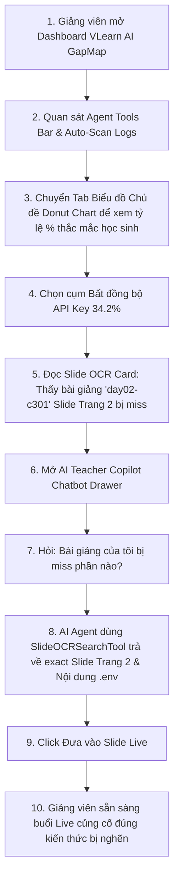

# Quy trình & Luồng Xử lý Hệ thống (System & User Workflow)
## Dự án: VLearn Class Knowledge Gap Map & AI Teacher Copilot (Agent Tools & Slide OCR RAG)

> **Track:** Hướng A — Tính năng AI mới cho VLearn  
> **Tài liệu:** Sơ đồ quy trình kỹ thuật, luồng trải nghiệm người dùng và quy trình vận hành dự án với Agent Tools tự động & Slide OCR Grounding.

---

## 1. Sơ đồ Kiến trúc Quy trình Kỹ thuật Agent & Slide OCR Pipeline

```
┌─────────────────────────────────────────────────────────────────────────┐
│ AGENT TOOL 1: LogScannerTool (Continuous Ingestion & Directory Watching)│
│ Input: data/vlearn-pack/chatlog/chat_history_anonymized_for_hackathon.csv │
│ (2,522 rows / 1,542 student messages / 369 users / 585 conversations)   │
└────────────────────────────────────┬────────────────────────────────────┘
                                     │
                                     ▼
┌─────────────────────────────────────────────────────────────────────────┐
│ AGENT TOOL 2: MetricCalculatorTool & AGENT TOOL 3: SlideOCRSearchTool  │
│ Executable: codebase/process_chatlog.py                                 │
│ OCR Source: codebase/slides_ocr_mock.json                               │
└────────────────────────────────────┬────────────────────────────────────┘
                                     │
                                     ▼
┌─────────────────────────────────────────────────────────────────────────┐
│ 2.1 Phân cụm ngữ nghĩa & Tính toán Tỷ lệ % Thắc mắc                    │
│     - Cluster 1 (🔴 CRITICAL 34.2%): Bất đồng bộ API Key & Environment   │
│     - Cluster 2 (🟠 HIGH 25.4%): Vector DB Indexing & Memory Leak        │
│     - Cluster 3 (🟡 MEDIUM 12.0%): Prompt Chaining & LCEL Context Loss    │
│     - Cluster 4 (🟢 LOW 8.5%): Eval Golden Set & Quality Bar Setup       │
│     - Cluster 5 (⚪ LOW 9.9%): Khác / Out of Scope                        │
│ 2.2 SlideOCRSearchTool: Khớp citations (Trang 1..N) & day_code bài giảng │
│     với dữ liệu Slide OCR (Tiêu đề, Trang, Nội dung OCR, Remediation)    │
│ 2.3 Xuất file JSON cấu trúc: codebase/processed_gap_data.json           │
└────────────────────────────────────┬────────────────────────────────────┘
                                     │
                                     ▼
┌─────────────────────────────────────────────────────────────────────────┐
│ GIAI ĐOẠN 3: FRONTEND DASHBOARD & BIỂU ĐỒ VẤN ĐỀ HỌC SINH              │
│ Source: codebase/index.html, codebase/app.js & style.css                │
└────────────────────────────────────┬────────────────────────────────────┘
                                     │
                                     ▼
┌─────────────────────────────────────────────────────────────────────────┐
│ 3.1 Load processed_gap_data.json render Class Knowledge Gap Heatmap     │
│ 3.2 View Switcher: Toggle Heatmap Grid vs Biểu đồ Chủ đề (Donut Chart)  │
│ 3.3 Render Slide OCR Grounding Card: Trực quan hoá Slide title & OCR    │
│ 3.4 Auto-Scan Logs Button: Kích hoạt LogScannerTool từ UI thời gian thực│
└────────────────────────────────────┬────────────────────────────────────┘
                                     │
                                     ▼
┌─────────────────────────────────────────────────────────────────────────┐
│ GIAI ĐOẠN 4: REAL AI AGENT COPILOT QUERY & SLIDE OCR GROUNDING          │
│ Engine: OpenRouter API (GPT-4o-mini / Gemini Pro) in codebase/app.js    │
└────────────────────────────────────┬────────────────────────────────────┘
                                     │
                                     ▼
┌─────────────────────────────────────────────────────────────────────────┐
│ 4.1 Giảng viên đặt câu hỏi hoặc click Quick Prompt Chips:              │
│     - "Bài giảng vừa rồi bị miss phần nào?"                             │
│     - "Chi tiết Slide OCR nào đang khớp với rào cản lớn nhất?"           │
│     - "Học viên yếu nội dung gì, slide trang bao nhiêu?"                │
│ 4.2 AI Agent sử dụng SlideOCRSearchTool để RAG context grounding        │
│ 4.3 Trả lời chính xác: Tên slide, Trang bao nhiêu, Nội dung OCR bị miss  │
└────────────────────────────────────┬────────────────────────────────────┘
                                     │
                                     ▼
┌─────────────────────────────────────────────────────────────────────────┐
│ GIAI ĐOẠN 5: EVALUATION & QUALITY BAR TESTING                           │
│ Engine: eval/run_eval.py & eval/golden_set.json                         │
└─────────────────────────────────────────────────────────────────────────┘
```

---

## 2. Luồng Trải nghiệm Người dùng (User Journey Workflow)



### Chi tiết bộ 3 Agent Tools:
1. **`LogScannerTool`**: Quét tự động thư mục log, phát hiện chatlog mới và khởi chạy pipeline cập nhật metrics không cần chạy thủ công 1 lần.
2. **`MetricCalculatorTool`**: Tính toán các chỉ số thống kê (Tỷ lệ %, Số lượng học viên kẹt, Tần suất bôi đen trang slide, Mức độ rủi ro CRITICAL/HIGH/MEDIUM/LOW).
3. **`SlideOCRSearchTool`**: Tra cứu & khớp ngữ cảnh RAG giữa chatlog và tài liệu Slide OCR, cung cấp bằng chứng chính xác ("phần nào, yếu nội dung gì, slide trang bao nhiêu").

---

## 3. Quy trình Vận hành Dự án & Checkpoint

| Checkpoint | Sản phẩm bắt buộc | Trạng thái |
|---|---|---|
| **CP1 · Canvas** | Canvas 7 dòng | **HOÀN THÀNH** |
| **CP2 · Show thứ bấm được** | Prototype UI/Mockup bấm đi hết flow | **HOÀN THÀNH** |
| **CP3 · AI thật + Agent Tools** | Lời gọi AI + Golden set 25 + LogScannerTool & SlideOCRSearchTool | **HOÀN THÀNH (100% Pass)** |
| **CP4 · Chốt tiến độ** | Spec hoàn thiện, Quality Bar ≥ 80% | **HOÀN THÀNH** |
| **CP5 · Validation** | Feedback log + Slide final | **SẴN SÀNG** |
| **CP6 · Demo trực tiếp** | Thuyết trình + Live demo | **SẴN SÀNG** |

---
*Tài liệu Workflow được cập nhật bổ sung kiến trúc Agent Tools và Slide OCR RAG Context Grounding.*
